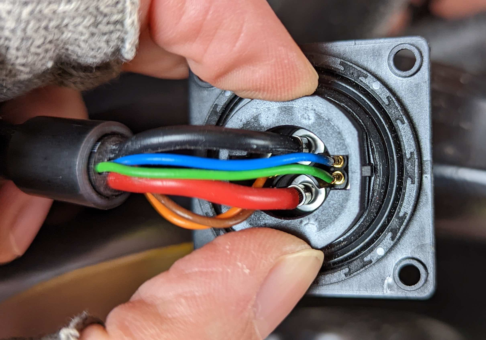
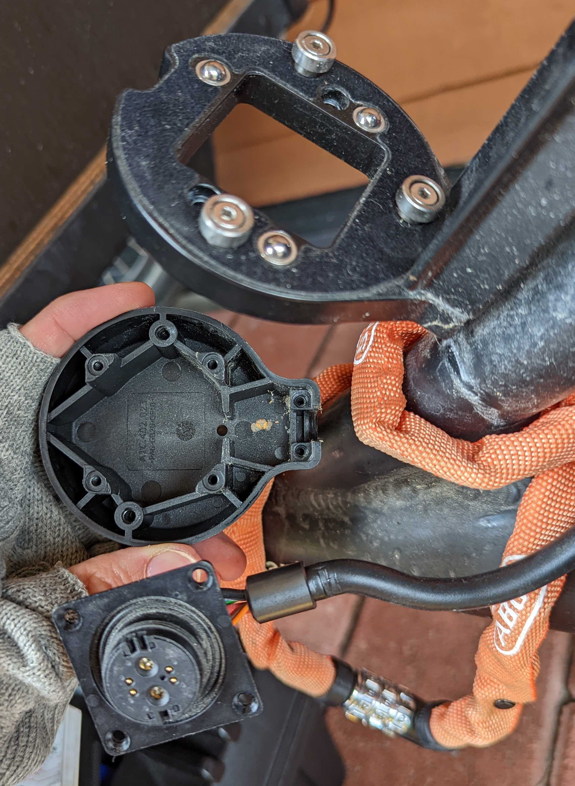

> :warning: **Warning:** While this guide doesn't do any irreversible damage to the Pendix system, it will probably void the warranty. So it is good to be familiar with electronics, and know what you are doing before starting.

This site contains instructions on how to connect bike lights to a [Pendix](https://pendix.com) e-bike drive.

## General

The [Pendix](https://pendix.com) e-bike retrofit kit is a good way to add e-bike capabilities to traditional bikes. It offers simple installation and supports multiple different frames due to its unique side-mounted motor. This makes it suitable for various cargo bikes as well. One issue with the kit is that it doesn't support any convenient way of connecting bike lights to the battery. On this site I will describe how I was able to connect front and back lights to the battery.

The Pendix battery provides a 48V DC current to the drive. This is delivered over a magnetic [Rosenberger RoPD](https://www.rosenberger.com/product/ropd/) connector in the battery and battery holder. My solution was to tap into this 48V current from within the battery holder housing. Luckily, the casing is easily opened with a couple of Torx screws. The battery holder housing has enough room to add an additional connection to the underside of the RoPD connector using 2 female quick disconnect crimp terminals, as well as a fuse for the bike light circuit.

### Initial power draw

The Pendix battery seems to have some kind of short  circuit safety feature which limits the max current allowed when initially connected. If the power draw is too high, the battery will cut the power. Once the engine has initialized, the full 250W power is available.

This behaviour is unfortunately not documented, so the detailed functionality is not known. The initial power draw seems to be limited to some unknown value between 0.6 and 2.4W (12.5mA and 50mA). Further testing would be needed to determine the exact value. If you have more information, please add a mention about it in the [discussions](https://github.com/aeirola/pendix-bike-lights/discussions/1).

Additionally, the exact behaviour for initializing the motor is not known. At least turning the pedals will initialize the motor, turning the rear wheel might also do the same.

This limitation mean high power lights need to have some kind of power control. The simplest solution is to use a manual switch for the lights, and only turn them on after touching the pedals. Alternatively, one could possibily identify the motor initialization from the data pins, but that would require additinal investigation.

## Parts needed

Here is a rough list of parts needed to connect lights to the battery. Linked products are just examples. Please make sure to verify that parts are suitable for your specific setup.

Additionally you will need some common electronics tools such as torx screwdrivers, multimeter and soldering iron.

- 2x [female quick disconnect crimp terminal](https://uk.farnell.com/amp-te-connectivity/9-160483-1/female-quick-disconnect-22awg/dp/3392344)
- [2-core cable](https://uk.farnell.com/belden/5500fe-00152/cable-sec-shld-grey-3-3mm-152/dp/1423283)
- Heat shrink tube
- Zip ties
- Bike lights
- Fuse (optional)
    - Not sure if really needed since the battery itself does have circuit protection. But made me feel safer that the motor won't stop working just because my bike light wiring would have some issues.
    - I used an [1A polyfuse](https://uk.farnell.com/littelfuse/60r050xpr/resettable-fuse-60vdc-40a-radial/dp/2383313) for this, as it is small enough to fit inside the battery holder casing.
- Switch (optional)
    - Needed if you are hitting the initial power draw limit.
    - Or if you want to be able to turn off the lights during daytime to save battery, although the power draw of the lights is quite low.
- Intermediary connectors
    - If you have multiple lights and switches, there will be quite a lot of wiring. So you might want to add some easily detachable connectors for the lights and switch. I used [XT60](https://www.sparkfun.com/products/10474) and XT30 connectors used in RC-cars, but 2 pin [AMP Superseal](https://uk.farnell.com/amp-te-connectivity/282080-1/socket-housing-circular-2-way/dp/150400) connectors used in real cars are also easy to get hold off.

## Instructions

Here are rough instrocutions of the steps needed to connect lights to the Pendix battery. Actually required steps will vary depending on the components and lights used.

1. Build the bike light power cable:
    1. Strip the wries from one end of the cable.
    2. Connect the female crimp terminals, and cover the crimped part with heat shrink tubing.
    3. Add some glue to the side of the crimp terminals flat side to make it grip to the connector wall.
    4. Add an optional fuse to the circuit.
3. Open the battery holder enclosure.
4. Attach the bike light power cable:
    1. Jam the female crimp terminals between the positive and negative poles of the RoPD connector. Make sure that there isn't any short circuiting between the positive and negative poles.
    2. Secure the bike light cable to the main motor cable with some zip ties so that it stays securely connected.
5. Route the light cable out of the housing and close it.
    - If the light cable is thick, you might not be able to fit in the strain relief along with the thick motor cable. In this case only put the motor cable in the strain relief, and secure the light cable to the motor cable with a zip-tie.
6. Attach lights and switches to the other end of the cable.

## Bike lights

There aren't that many 48V bike lights available, so here are some I've found:
- [Büchel](https://buechel-online.com/en/bicycle-lighting/) has multiple 48V bike lights both for [front](https://buechel-online.com/en/shiny-80/) and [back](https://buechel-online.com/en/z-fire-mini/) with various [light output levels](https://buechel-online.com/en/shiny-120/). Not too expensive.
- [Busch + Muller](https://www.bumm.de/en/products/e-bike-scheinwerfer.html) also has some more 48V front lights. Though these are a bit more expensive.

Alternatively you could also add a step down voltage convertor to use 12V or 24V lights.

## Other power source

The Pendix battery has a built in USB-C output for charging a phone etc. This could also be used to power bike lights, but is only rated for 5V 1.5A (7.5W), which might not be enough for brighter lights. Additionally it requires a separate cable to be plugged every time the battery is mounted.

---

For questions, disussion or sharing your own experiences, head over to the [discussions](https://github.com/aeirola/pendix-bike-lights/discussions).
